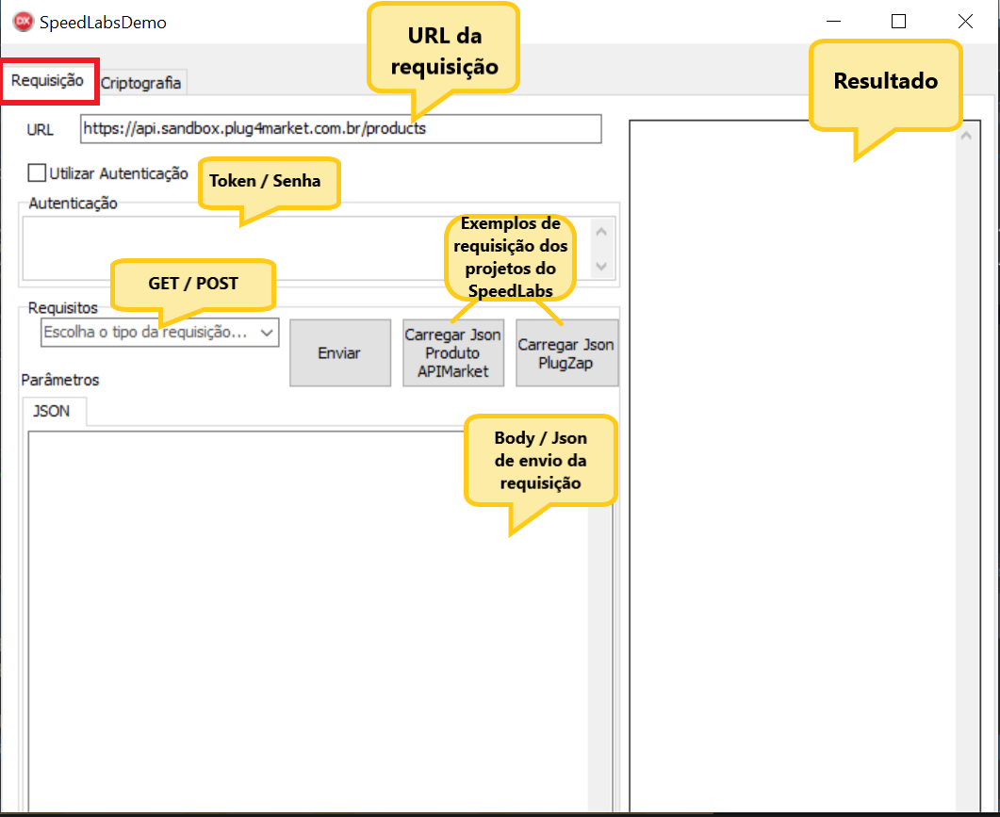
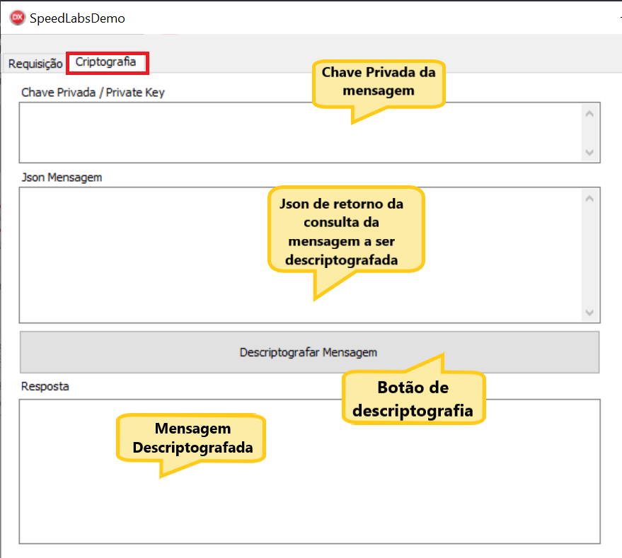

 

<h1 align="center">
    Demo SpeedLabs Delphi
</h1>

## 💻 Sobre a Demo

Esta demo foi criada com o intuito de exemplificarmos casos de uso das APIs do SpeedLabs da Tecnospeed em Delphi.

---

## ⚙️ Funcionalidades

- [x] Requisições HTTP
- [x] Descriptografação de mensagens (PlugZapi)

---

## 🚀 Como executar o projeto

### Pré-requisitos

* A demo foi criada no Delphi 10.3.

* Baixar o <a href="https://github.com/lminuti/Delphi-OpenSSL">wrapper para OpenSSL</a>

* Apontar no SearchPath do projeto a pasta Source do repositório baixado acima

---

## 🎲 Guia da Demo

### Aba Requisição

> 

---

### Aba Criptografia

> 

---
